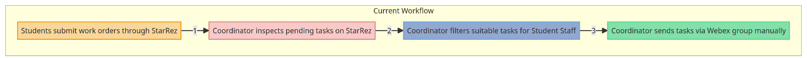
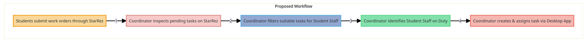
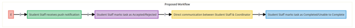
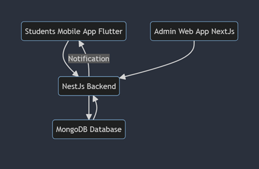

Chosen idea - **Residence Maintenance Management Mobile Application**
 Description - _Extend the existing desktop-only maintenance reporting tool for residence life work to a mobile platform. Streamline notifications and task assignment for employees on duty, including details such as campus dorm location and room number. Incorporate ML for inventory suggestions based on historical data and potential tool requirements._

Below, I will provide an example of the workflow that is currently in place that applies for Operations at Arkansas Tech Residence Life and then I will propose a workflow that will simplify this process using our application.

**Current Workflow**

1. Students living on campus submit work orders through StarRez\* platform.
2. Coordinator for Operations\*, starts inspecting list of pending tasks on StarRez\* (Desktop only, administrative side) and filters out tasks that might be suitable for Student Staff.
3. Once such tasks are identified on StarRez, or from other source, Coordinator for Operations\* usually sends out a text in Webex group, manually tagging student staff on shift and manually typing task description in a non-structured way.

This causes the workflow to be inefficient for following reasons -

- It is unknown whether the Student Staff on shift is in progress of completing tasks or not.
- Tasks are not structured consistently, causing confusion and clutter among different topics in the same chat.
- Students have restricted possibilities to follow up on tasks and ask questions to task assigner.
- Coordinator for Operations\* does not have ability to efficiently see progress of tasks assigned to Student Staff.
- In case when multiple tasks come up, chat usually gets cluttered, tasks get lost, and it becomes impossible to track the progress of tasks.

**Proposed Workflow**

1. Students living on campus submit work orders through StarRez\* platform.
2. Coordinator for Operations\*, starts inspecting list of pending tasks on StarRez\* (Desktop only, administrative side) and filters out tasks that might be suitable for Student Staff.
3. Coordinator for Operations\* has visibility and can identify, through our application's Desktop interface on who of the Student Staff is currently on Duty.
4. Intuitive desktop application allows Coordinator to start creating a task in constructive manner and assigning it to identified Student Staff member. This includes input boxes such as location of the issue, description of the issue and possible instruments necessary to resolve the issue.
5. After the task has been created, assigned Student Staff members (through our mobile application) will receive a push notification, alerting them of an assigned task.
6. Student Staff members will be able to mark assigned task as Accepted (In Progress) and Rejected (Provide comment). This will become visible on the Coordinator's dashboard.
7. During the task, student staff member will be able to communicate directly with the Coordinator, in a separate chat for each task. This will allow messages to not clutter up.
8. After finishing a task, student staff member will be able to mark it as Completed or Unable to Complete (provide reason). This can also be viewed by the Coordinator.

Proposed Workflow has a high chance of increasing efficiency as it will achieve following -

- Coordinator will be aware which tasks are being worked on.
- Coordinator will be aware of Student Staff members on shift and won't need to refer to external data sources or guessing.
- Student Staff members will have a greater awareness of the task they are assigned to.
- The possibility of miscommunication will be drastically lowered.
- Student Staff members and Coordinator will be able to have Task related chats, eliminating any possibility of information clutter.
- The coordinator's dashboard could be extended to allow for advanced data analytics. Task histories could be exported and inspected thoroughly to see completion rates, rejected tasks that might require more staff training and attention

_\*StarRez – Software suite in place that is currently used by Arkansas Tech University to manage all housing operations such as booking room, booking meal plans, and submitting maintenance reports. StarRez offers interface for students as well as an administrative interface meant for Staff to manage processes._

_\*Coordinator for Operations – Person responsible for maintenance of Residence Life areas. This includes all dormitories and common living spaces on campus._

Technical Requirements for given project -

1. ⁠[Flutter](https://flutter.dev/) (For developing multi-platform mobile application for student workers)
  1. We will be focusing heavily on using [Material 3](https://m3.material.io/components) (Material Design) for components.
  2. Udemy course (TBA)
  3. Research best practices, usages with Material 3 components and example projects on GitHub. Create example applications on our own as part of the research process.
2. [NestJS](https://nestjs.com/) (For creating backend application for server-side logic).
  1. Pure API functionality, server will be used purely for REST communication (no view rendering).
  2. Focus heavily on TypeScript.
  3. Clean architecture and exhaustive usage of most popular third-party libraries.
  4. Integration with MongoDB using mongoose.

_ **NOTE: NestJS has been chosen as an alternative to Express.js chosen earlier.** _

1. [NextJS](https://nextjs.org/) (For developing web application for Administrator managing the workflow of application, such as assigning tasks to students on shift, managing inventory, managing shifts etc.)
  1. Focus heavily on TypeScript.
  2. Utilizing [Material-UI](https://mui.com/material-ui/) for modern, responsive design with less code.
  3. [NextAuth.js](https://next-auth.js.org/) for advanced authorization, including possible SSO (single sign on) integration with OneTech
  4. Focus on client-side logic. Even though NextJS offers server-side functionality, we will be utilizing it purely for client purposes. Server-side logic will be done by NestJS.
2. [MongoDB](https://www.mongodb.com/) (As a NoSQL database. Will be integrated with NestJS using mongoose library).

_Figure 1 High level workflow_

